# PLAN: Cybersecurity Club Application Security Audit

This document outlines the detailed security audit plan for the university cybersecurity club application. It defines the methodology, scope, targeted hotspots (auth, RBAC, business logic, file uploads, injection, and secrets), verification steps, and a formal report template.

---

## 1. Overview & Objectives

### 1.1 Context
The target application is a university cybersecurity club management system. As a platform run by and for security enthusiasts, it manages sensitive student data (PII), club ledger funds, event seat limits, and official certificates. A security compromise would lead to:
- **Reputational Damage:** Club credibility is lost if a cyber club app is breached.
- **Financial Fraud:** Unauthorized ledger modifications or payment self-approvals.
- **Academic Dishonesty:** Self-issuing or auto-approving awards (Excellence, Winner) without credentials.
- **Data Theft:** Mass harvesting of student phone numbers, student IDs, and emails.

### 1.2 Scope of Audit
The audit will target the full Next.js stack, specifically inspecting API routes (`src/app/api/`), authorization utilities (`src/lib/auth.ts`, `src/lib/supabase-server.ts`), file upload processing, database constraint enforcement in Prisma schema, and potential front-end injection areas.

---

## 2. Tech Stack & Attack Surface

### 2.1 Technology Stack
- **Framework:** Next.js (App Router, Server Actions, API routes)
- **Database ORM:** Prisma ORM with Supabase PostgreSQL
- **Session & Auth:** Supabase SSR (cookie-based) with fallback configuration checks
- **Styling:** Tailwind CSS (v4)

### 2.2 Attack Surface Mapping

```mermaid
graph TD
    Client[Client Browser]
    
    %% Entry Points
    Client -->|Unauthenticated / GET| CertOG["/api/certificates/[code]/og (SVG Gen)"]
    Client -->|Unauthenticated / POST| UploadAPI["/api/upload (File Upload)"]
    Client -->|Unauthenticated / POST| EventReg["/api/events/[id]/register"]
    Client -->|Unauthenticated / GET| UsersApproval["/api/users/approval (GET)"]
    Client -->|Unauthenticated / PATCH| UsersApprovalPatch["/api/users/approval (PATCH)"]
    Client -->|Unauthenticated / GET| UsersID["/api/users/[id] (GET/PATCH)"]
    
    %% Authenticated Entries
    Client -->|Authenticated / GET| LedgerAPI["/api/ledger (Financial Ledger)"]
    Client -->|Authenticated / PATCH| PayVerify["/api/payments/[id]/verify"]
    Client -->|Authenticated / PATCH| CertApprove["/api/certificates/[code]/approve"]
    Client -->|Authenticated / PATCH| RoleUpdate["/api/users/[id]/role"]
    
    %% Backend Services
    CertOG --> Prisma[(Database)]
    UploadAPI --> SupabaseStorage[Supabase Storage]
    EventReg --> Prisma
    UsersApproval --> Prisma
    UsersApprovalPatch --> Prisma
    UsersID --> Prisma
    LedgerAPI --> Prisma
    PayVerify --> Prisma
    CertApprove --> Prisma
    RoleUpdate --> Prisma
```


---

## 3. Vulnerability Hotspots & Checkpoints

The audit will specifically inspect and document findings for the following known hotspots:

### 3.1 Authentication & Session Security (A07:2025)
- **Endpoint:** `/api/auth/google-user`
  - **Checkpoint:** Verify session verification calls `supabase.auth.getUser()` rather than `supabase.auth.getSession()`. The latter parses the cookie locally without validating the JWT signature on the Supabase backend, enabling cookie spoofing.
- **State Inconsistencies:**
  - **Checkpoint:** Inspect NextAuth handlers in `src/lib/auth.ts` vs Supabase server clients in `src/lib/supabase-server.ts` to ensure session states do not drift or create parallel authorization frameworks.

### 3.2 Broken Access Control & IDOR (A01:2025)
- **Endpoints:** `/api/users/approval` (GET & PATCH)
  - **Checkpoint:** Ensure the GET route is authenticated and restricted to executives (PII leak risk).
  - **Checkpoint:** Validate that the PATCH route calls `getSupabaseUser` rather than trusting the `approverId` provided in the client's request body (privilege escalation bypass).
- **Endpoints:** `/api/users/[id]` (GET & PATCH)
  - **Checkpoint:** Ensure GET `/api/users/[id]` does not allow arbitrary unauthenticated users to download other users' payment proofs, transaction IDs, or personal phone numbers.
  - **Checkpoint:** Validate that PATCH `/api/users/[id]` restricts profile updates to the owner of the account or a `PLATFORM_ADMIN`/`PRESIDENT`.
- **Endpoints:** `/api/ledger` (GET)
  - **Checkpoint:** Restrict ledger details and account balances to executive roles (`TREASURER`, `PRESIDENT`, `PLATFORM_ADMIN`).

### 3.3 Business Logic & Integrity Vulnerabilities (A04/A08:2025)
- **Self-Approval Controls:**
  - **Checkpoint:** Inspect `/api/payments/[id]/verify` and ensure a caller cannot verify or approve their own payment submissions.
  - **Checkpoint:** Inspect `/api/certificates/[code]/approve` and ensure the President or GS cannot approve awards or certificates issued to themselves.
- **Transaction & Registration Duplications:**
  - **Checkpoint:** Check `/api/events/[id]/register` to ensure `transactionId` submissions are unique and prevent payment replay fraud.
- **TOCTOU Race Conditions:**
  - **Checkpoint:** Check registration limit logic for `LIMITED` events. Standard read-then-write updates are susceptible to capacity bypass under concurrent registrations. Verify if transaction isolation, atomic operations, or locking is implemented.
- **GET Request Side-Effects:**
  - **Checkpoint:** Verify if GET `/api/certificates` with `eventId` modifies state (`prisma.certificate.create`) during a read operation.

### 3.4 Input Validation & Injection (A05:2025)
- **Stored XSS in SVG Generation:**
  - **Endpoint:** `/api/certificates/[code]/og/route.ts`
  - **Checkpoint:** Inspect parameters parsed from `certificateLayout` JSON (e.g., `bgImage`, `primaryColor`, `secondaryColor`, logo URLs). Verify if they are escaped using `escapeXml` before being outputted in the SVG payload. If not, they could allow SVG-based Stored XSS.
- **Prisma SQL Injection Safety:**
  - **Checkpoint:** Scan database operations for dynamic string concatenation (`$queryRaw` or `$executeRaw`).

### 3.5 File Upload Security (A08:2025)
- **Endpoint:** `/api/upload/route.ts`
  - **Checkpoint:** Check authentication constraints (currently public upload allowed).
  - **Checkpoint:** Verify file extension extraction. Ensure filenames containing multiple extensions (e.g., `shell.png.html`) do not bypass checks.
  - **Checkpoint:** Verify if MIME-type filtering checks file headers/magic bytes or relies solely on the client-supplied `file.type` header.

### 3.6 Cryptography & Secrets (A04:2025)
- **Secrets Scanning:**
  - **Checkpoint:** Search codebase for committed API keys, tokens, database credentials, or Supabase service keys.
  - **Checkpoint:** Validate environment file exclusions in `.gitignore`.

---

## 4. Audit Steps & Task Breakdown

These steps will be executed to perform the security review and generate the audit report.

- [ ] **Task 1: Automated Vulnerability & Dependency Scan**  
  *Action:* Run the automated script `.agent/skills/vulnerability-scanner/scripts/security_scan.py` to identify initial code patterns and outdated packages.  
  *Verify:* Command outputs JSON/text report to workspace showing dependency alerts and basic pattern matches.  
  *Command:* `python .agent/skills/vulnerability-scanner/scripts/security_scan.py .`

- [ ] **Task 2: Authentication & Session Review**  
  *Action:* Perform a line-by-line review of `src/app/api/auth/google-user/route.ts` and `src/lib/supabase-server.ts`. Validate cryptographic token verification.  
  *Verify:* Document whether session tokens are cryptographically checked on the backend and if cookie state drifts.

- [ ] **Task 3: Access Control & IDOR Inspection**  
  *Action:* Review `src/app/api/users/approval/route.ts`, `src/app/api/users/[id]/route.ts`, and `src/app/api/ledger/route.ts` for missing `getSupabaseUser()` checks.  
  *Verify:* Identify routes that permit unauthenticated access or trust ID parameters/parameters in request bodies.

- [ ] **Task 4: Business Logic & Anti-Replay Analysis**  
  *Action:* Analyze `src/app/api/payments/[id]/verify/route.ts`, `/api/certificates/[code]/approve/route.ts`, and `/api/events/[id]/register/route.ts` for self-approvals, TOCTOU capacity bypass, and duplicate transactions.  
  *Verify:* Document precise control flaws and code paths for business rule evasion.

- [ ] **Task 5: Injection & File Processing Review**  
  *Action:* Audit `/api/certificates/[code]/og/route.ts` for SVG injection/XSS and `/api/upload/route.ts` for file signature check bypasses.  
  *Verify:* Confirm if parameters inside SVG generation are sanitised and if upload MIME types can be spoofed.

- [ ] **Task 6: Secret Exposure Audit**  
  *Action:* Verify `.gitignore` constraints and scan configs for hardcoded credentials.  
  *Verify:* Confirm that `.env` files are not tracked in git and no secrets exist in the git history.

- [ ] **Task 7: Report Compilation**  
  *Action:* Compile all findings into a structured markdown report under `docs/SECURITY-AUDIT-REPORT.md` using the template below.  
  *Verify:* File `docs/SECURITY-AUDIT-REPORT.md` exists and contains critical/high/medium/low findings with clear reproduction steps.

---

## 5. Done When (Success Criteria)

- [ ] Automated security scan script is executed.
- [ ] Authentication logic review is complete.
- [ ] Access control policies are mapped and reviewed against the 5 primary user roles.
- [ ] SVG generator injection risks are verified.
- [ ] File upload API validation rules are reviewed.
- [ ] A final security report `docs/SECURITY-AUDIT-REPORT.md` is compiled detailing findings and remediation steps.

---

## 6. Audit Report Template

When executing the audit, findings will be documented in `docs/SECURITY-AUDIT-REPORT.md` using this exact structure:

```markdown
# Security Audit Report: University Cybersecurity Club Application

**Date:** [Current Date]  
**Auditor:** Security Auditor & Architect  
**Status:** DRAFT / FINAL  

---

## Executive Summary
[Brief description of overall security posture, total number of vulnerabilities categorized by severity, and key risk areas].

| Severity | Count | Impact |
|---|---|---|
| Critical | 0 | Remote Code Execution, Authentication Bypass |
| High | 0 | Privilege Escalation, Complete PII Exposure, Business Logic Bypass |
| Medium | 0 | Stored XSS, Authorization Gaps on Non-Critical APIs |
| Low | 0 | Best Practices, Missing Security Headers |

---

## Detailed Findings

### [Finding ID: SEC-001] [Vulnerability Name]
- **Severity:** [Critical / High / Medium / Low]
- **OWASP Category:** [e.g., A01:2025-Broken Access Control]
- **Location:** `src/app/api/.../route.ts` (Lines X-Y)

#### Description
[Describe what the vulnerability is, why it occurs, and the code patterns that trigger it].

#### Proof of Concept (PoC)
```bash
# Example curl or request payload showing how to trigger the vulnerability
curl -X PATCH http://localhost:3000/api/... \
  -H "Content-Type: application/json" \
  -d '{"exploit": "true"}'
```

#### Impact
[Describe the business or technical impact: who can access what, what data can be tampered with, etc.]

#### Remediation
[Step-by-step code correction recommendation].
```typescript
// Proposed fix implementation snippet
```

---

## Verification & Retest Results
[Table showing when findings are resolved and verified].
```

---

## 7. Phase X: Final Verification

Prior to signing off the audit plan as complete, the following commands must run successfully:

```bash
# Run automated security scans
python .agent/skills/vulnerability-scanner/scripts/security_scan.py .

# Run global codebase verification
python .agent/scripts/checklist.py .
```

### Manual Checklist Compliance
- [ ] Verify that no credentials reside in active configuration files.
- [ ] Verify that all user-facing paths require explicit session checks.
- [ ] Socratic Gate was respected.
